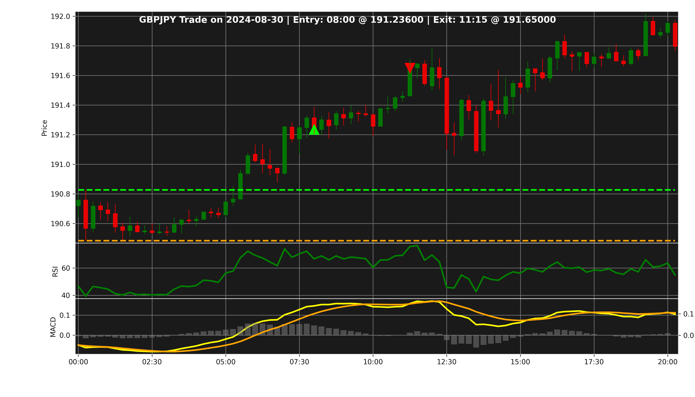

# "London Open Breakout Strategy" Backtest


[](https://codecov.io/gh/mhzardary/london-strategy-backtest)


While studying various strategies for trading the FOREX market, I came across the **"London Open Breakout 
Strategy"** — a well-known approach aimed at achieving stable, low-risk profits.[1],[2],[3] 

This project implements a backtesting framework for this strategy on EUR/USD, GBP/USD, and GBP/JPY markets.
It uses price action, Asian session range breakout logic, and filters based on economic news data.
I have also used MACD and RSI as momentum indicators to avoid false breakouts, filtered out trades on days with major
economic news, and applied the SMA to follow the market trend. However, using these momentum indicators, news filters,
or trend-following logic is optional and depends on your preferences.

My investigation shows weak results when applying this strategy. (At least with the most common variations on the
mentioned markets). I have also tried to make the project as flexible as possible, to easily modify for further
analysis.

## 📚 Table of Contents

- [Strategy Overview](#strategy-overview)
- [Project Goals](#Project-Goals)
- [How to Customize](#How-to-Customize)
- [Required Data](#Required-Data)
- [Features of the current version](#Features-of-the-current-version)
- [Results](#Results)
- [Requirements](#Requirements)
- [Quick Start](#Quick-Start)
- [References](#References)

## Project Goals
The main goal of this project is to evaluate the effectiveness of the 'London Open Breakout Strategy' using
a structured, transparent backtesting framework.

This project is not about proving the strategy "works" — it is about discovering when and how it works best (if at all),
and building a toolset that allows others to continue that exploration.

Since interpreting the outcomes is more valuable than just generating trade signals, a detailed results analysis module
has been built. You can skip to the [Results](#results) section to see how the performance is evaluated.

## Strategy Overview
The idea behind the "London Open Breakout Strategy" is based on the belief that during the first 1.5 hours of the
London session the market has the potential to break through the daily support or resistance of the Asian session,
and if the breakout happens, market will show a considerable average shift. The following table reviews the key
properties of this strategy.

***Strategy Overview Table***

| **Aspect**                | **Details**                                                          |
|---------------------------|----------------------------------------------------------------------|
| Strategy Type             | Breakout trading at London session open based on Asian session range |
| Core Concept              | Trade breakout above or below Asian session high/low                 |
| Timeframe to Mark Range   | Asian session                                                        |
| Entry Signal              | Candle closes outside Asian session range at London open             |
| Stop Loss Placement       | Just outside opposite side of range                                  |
| Profit Target             | Generally 1.5x to 3x risk; typically 20–30 pips                      |
| Win Rate                  | Approx. 50%–55%                                                      |
| Best Pairs                | GBP/USD, EUR/USD, GBP/JPY                                            |
| Potential Advantages      | Simple, objective, exploits high liquidity and volatility            |
| Risks                     | False breakouts, news spikes, spread widening                        |
| Suggested Risk Management | Risk 1%–2% per trade; use confirmation to avoid false breakouts      |


## How to Customize
Like any other strategy, there are an infinite number of variations can be explored by adjusting the strategy's
parameters. Some variables that I have considered in this code to allow for flexible analysis include:
- Using news days to skip trading, using RSI to confirm breakouts, using MACD to confirm breakouts
- Timeframe to mark range (some prefer a portion of the Asian session to extract the range of the market)
- Using the SMA to avoid trading against the trend, with a customizable window
- Take-Profit value (Profit range can be considered as long as 2 times of Asian market range or a fixed amount of pips)
- Stop-Loss value (Loss range can be considered as long as the Asian market range or a fixed amount)
- Time-frame for backtesting (Tested on 15 minutes and 30 minutes time-frames)
- Start and end date of the analysis

## Required Data
The main dataset required to run this code is the market data of EUR\USD, GBP\USD, and GBP\JPY in 15 minutes
(recommended in references). However, there are functions to connect to your MetaTrader5 to fetch the historical data
to use the data provided by your broker. If the analysis skips trades on major news days, you will also need an Excel
file listing each currency and the analysis days, with a 1 inserted in cells that there are news. In the current repo,
market data and the news data are included in data folder starting from 2024/07/12 to 2025/07/11.


## Features of the current version
- SMA, RSI and MACD integration
- News filtering
- Position tracking (SL/TP logic)
- Time-based exit logic (Positions will close at the end of the day.)

## Results
By selecting different variables for this analysis the results would differ. These results are based on a sample
configuration and may vary depending on parameters selected.The current configuration is:
1. Time frame is 15 minutes
2. Skipping signals on news days
3. Asian time range to extract the range: 00:00 to 07:00 GMT
4. using SMA with a time window of 50
5. Take Profit range is equal to two times of the Asian session range
6. Stop loss range is equal to range of the Asian session range
7. Start date is 2024/07/21
8. End date is 2025/07/20

These plots show the performance of this strategy:

### 1. cumulative Profit and Loss (in USD)

.png)

Key insights:

Trends in GBPJPY is stronger.

EURUSD remains relatively flat, with low volatility and minor gains.

GBPUSD shows the weakest performance, ending near breakeven or slightly negative.

The strategy performs best from August 2024 to January 2025, with a noticeable peack and mild drawdown afterward.

This result emphasizes the importance of pair selection, dynamic filters, and seasonal market conditions.

This highlights the importance of ongoing evaluation and adaptive parameter tuning.

### 2. Strategy performance based on direction of signals:

.png)

As you can see, the confusion matrix below shows how well the strategy predicted price direction after generating trade
signals.

- **Total predictions:** 242  
- **Accuracy:** ~54.1%  
- **True Positives (Buy → Price Up):** 74  
- **True Negatives (Sell → Price Down):** 57  
- **False Positives (Buy → Price Down):** 65  
- **False Negatives (Sell → Price Up):** 46  

The strategy correctly predicts upward moves more often than downward ones. However, a high number of false buy signals
suggests further refinement is needed — particularly around breakout confirmation and market condition filters.

*You can find individual confusion Matrix for each symbol (EURUSD, GBPUSD, GBPJPY) saved in the `results/` folder.*

### 3. Distribution of Profits and Losses
.png)

This histogram shows the distribution of profit and loss per trade, based on all trades during the backtest period.

- **Average PnL per trade:** +0.00018 USD  
- **Standard deviation:** 0.00429 USD  

Most trades result in small gains or losses, forming a roughly normal distribution. The slightly positive mean
indicates a mild statistical edge. A few outliers on the positive side suggest the presence of rare, highly profitable
trades. Risk appears controlled, but refining entry conditions and reward-risk ratios may enhance returns.

*You can find individual Profit and Loss histograms for each symbol (EURUSD, GBPUSD, GBPJPY) saved in the `results/`
folder.*

### 4. A sample profitable long position from this strategy



This chart shows a profitable buy (long) trade generated by the London Open Breakout strategy. The entry
occurred after a breakout above the Asian session high, followed by a price increase that hit the TP level.

*Additional examples, (Unprofitable long trades, Profitable short (sell) trades, Unprofitable short trades) are
available in the `results/` folder for further analysis and comparison.*

## Requirements
- Python 3.9+
- MetaTrader5 (installed and configured)
- Python libraries listed in requirements.txt file

## Quick Start
Follow these steps to set up and run the **London Open Breakout** strategy on your machine.

### 1. Clone the Repository
```bash
git clone https://github.com/mhzardary/london-strategy-backtest.git
cd london-strategy-backtest
```
### 2. Create and Activate a Virtual Environment (optional but recommended)
```bash
python -m venv .venv
```

#### On Windows:
```
.venv\Scripts\activate
```
#### On Mac/Linux:
```
source .venv/bin/activate
```
### 3. Install Dependencies
```bash
pip install -r requirements.txt
```
### 4. Set Up Environment Configuration
Create a `.env` file inside the `config/` folder, check `env.example` as a template.

### 5. Run the code
```bash
python main.py
```
### 6. View Results
Results will be saved in ```results``` folder.

### 7. Running Tests (Optional)

To run all unit tests:

```bash
pytest test/
```

## For Further Research

While this project provides a solid foundation for testing the London Open Breakout Strategy, these enhancements can
be considered to improve strategy:

### 1. Considering Technical Support & Resistance Zones

Considering supports and resistance of higher time frames may help to avoid false signals.

### 2. Pre-London Breakout Filtering

Some trades trigger in the London session, however the breakout has happened during late hours of Asian session. These
trades should be filtered out.

### 3. Adaptive TP/SL

This project considers either a TP/SL equal to Asian session range or a fixed range. Using adaptive TP SL based on market
conditions could enhance the profit.

### 4. Volume Confirmation
I would consider tick volume as an estimation of real volume to confirm the breakouts.

### 5. Volatility Clustering
Using indicators like Bollinger Bands or ATR would help to filter out some fake breakouts.

## License
This project is licensed under the MIT License.

## Disclaimer: 
This software is provided for educational and research purposes only. Use it at your own risk. The author assumes no responsibility for any losses or damages resulting from the use of this software.


## References

[1]: https://www.dailyforex.com/forex-articles/london-breakout-strategy/210474
*London Breakout Strategy – What it is & How to Trade it!* (2024)

[2]: https://www.quantifiedstrategies.com/london-breakout-strategy/
*London Breakout Strategy: Rules and Backtest Performance* (2025)

[3]: https://www.keenbase-trading.com/london-breakout-strategy/
*Keenbase Editorial Staff _. (2020). London Breakout Strategy - A Simple way of Day Trading*


